# Beautiful Chat

A Paseo plugin that redraws the Oh My Pi (OMP) chat stream: tool calls, reasoning, prompts, approvals,
and checklists. It replaces the host rendering of OMP timeline items with typed, syntax-aware cards
that follow the active Paseo theme.

Every screenshot below is a capture of the real component, rendered by the harness in `.showcase/`.

## Install

```bash
paseo plugin install /absolute/path/to/beautiful-chat
```

The manifest requires Paseo `>=0.8.0-beta.1`. Open **Settings → Plugins → Beautiful Chat** for the
accent, fonts, frosted glass, and prompt bubble options.

---

## Tool calls

### Shell and Git

Terminal frame, Bash syntax, exit code, duration, and the Git brand mark. A command that prints
nothing says so rather than showing an empty panel.

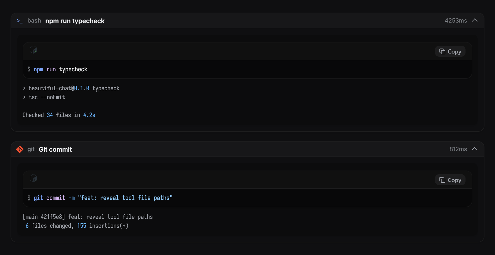

### Read

The file's own language logo, a wrapped path, line numbers, and a copy button. The path is a link:
pressing it shows the file in the machine's file manager.

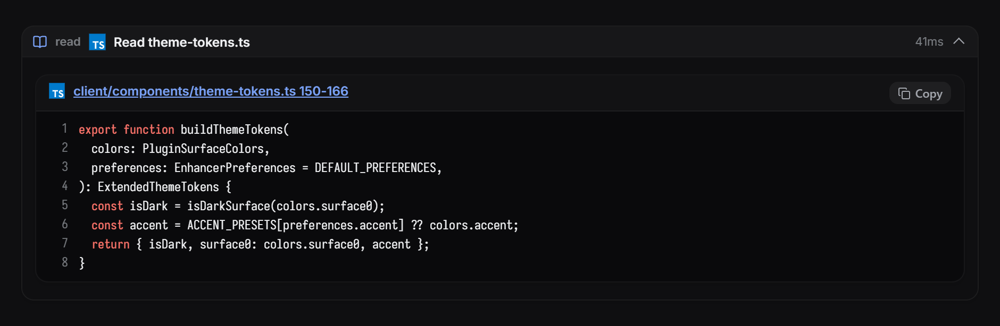

### Edit

Diff rendering where adjacent removed and added rows join into one rounded block, and only the
marker column carries the red or green.

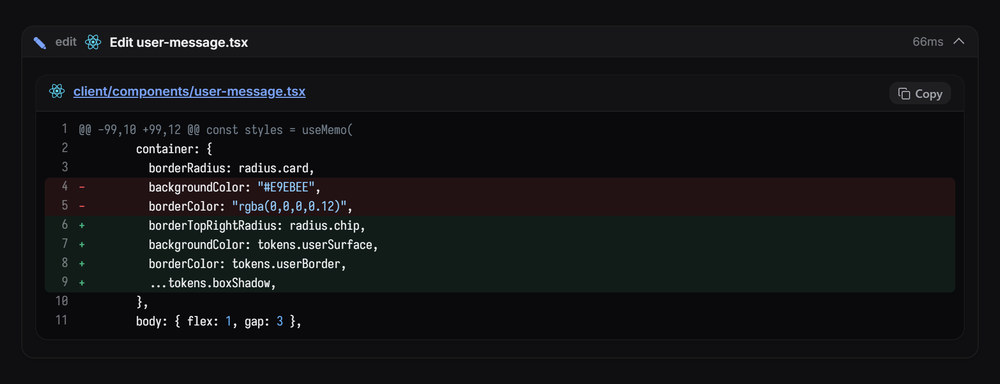

### Reasoning tool

Live thinking text, a token badge, and numbered steps.

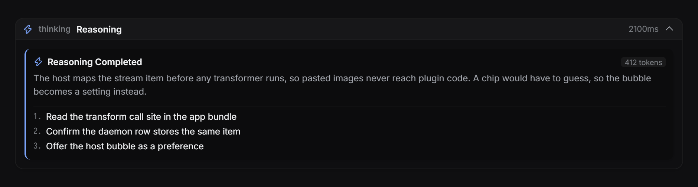

### MCP

Server badge, transport, input parameters, and the response payload, each syntax-highlighted.

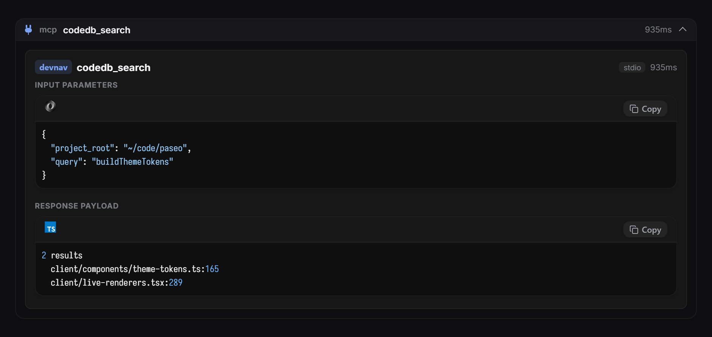

### Eval

One card per kernel cell: the source that ran, then the text it printed.

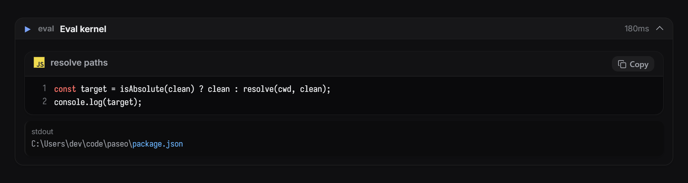

### Ask

Option cards with the recommended badge, the chosen answer marked, and a typed reply labelled as
typed rather than shown as a selection.

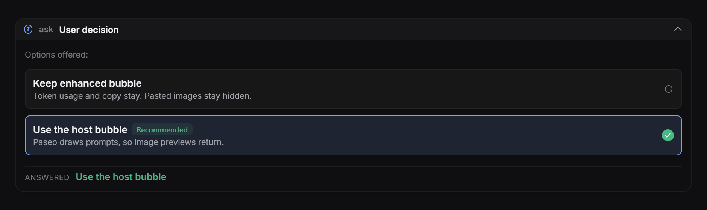

### Task

Subagent name, type, model, and the delegated instructions.

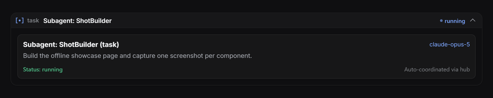

### Hub

Peer messages and supervised processes, including port, readiness pattern, and recent output.

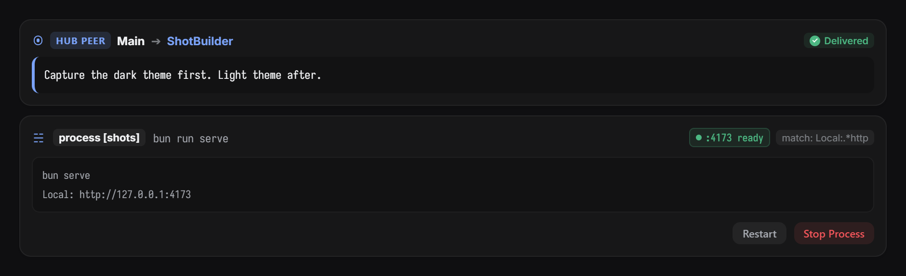

### Paseo tools

Agent creation, activity, providers, and models, with the provider's own brand mark.

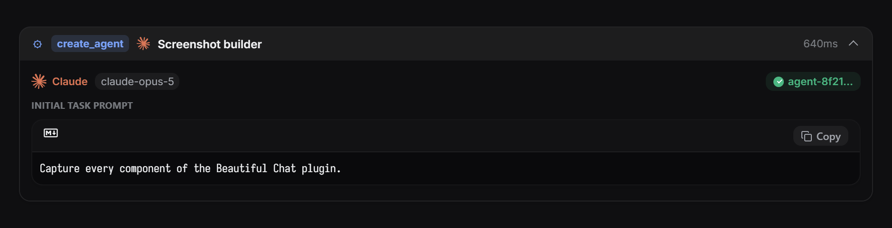

---

## Stream components

### Reasoning trace

A collapsible trace with a connected step rail, per-step duration, and a token total.

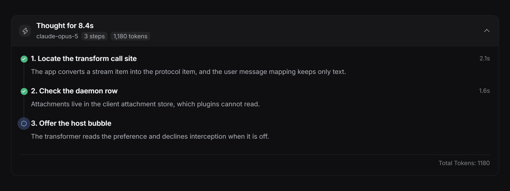

### Checklist

Phase name, per-task status, durations, and a blocked task with its reason.

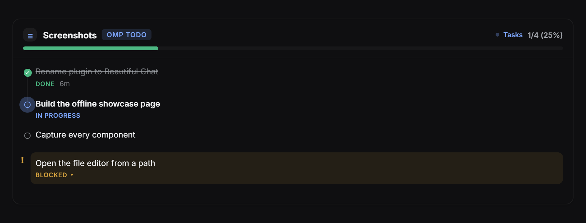

### Approval card

Risk classification, the exact command, target path, working directory, and the approve or deny
actions the host owns.

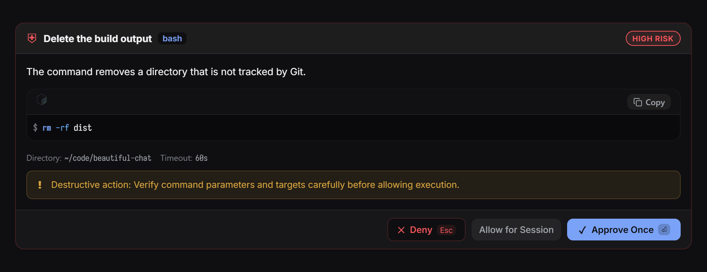

### Prompt bubble

The authored turn on a raised theme surface with a square tail, a copy button, and the turn's token
usage.

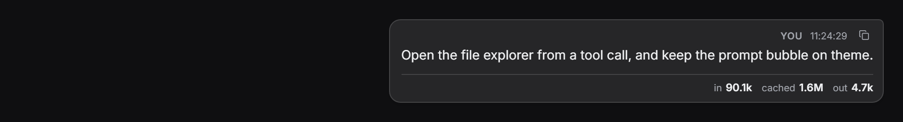

### Syntax block

Shared by every card that shows code: language detection from the path, line numbers, diff tints,
Devicon brand marks, and the file-manager link.

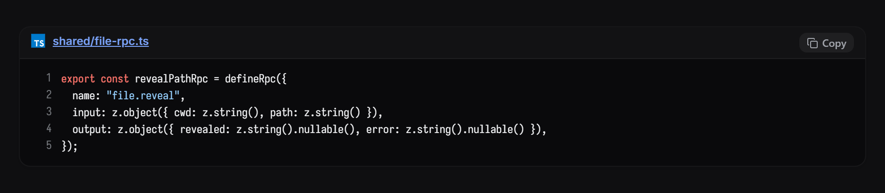

---

## Settings

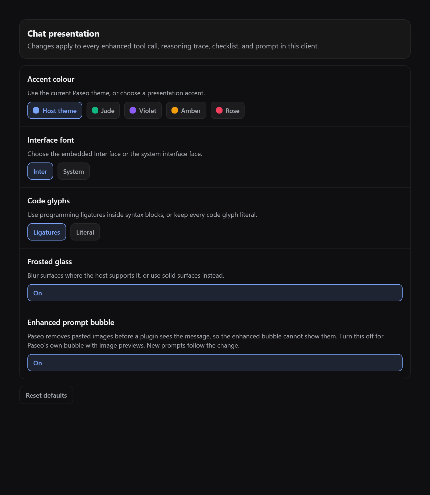

| Setting | Effect |
| --- | --- |
| Accent colour | Follow the Paseo theme, or pick Jade, Violet, Amber, or Rose. |
| Interface font | Embedded Inter, or the system interface face. |
| Code glyphs | Iosevka with ligatures, or literal glyphs. |
| Frosted glass | Blur card surfaces, or paint them solid. |
| Enhanced prompt bubble | Off hands prompts back to Paseo, whose bubble shows pasted images. |

---

## Opening files

A file name in a read, write, edit, or code block is a link. Pressing it calls the plugin's own
daemon-side RPC (`file.reveal`), which resolves the path against the agent's working directory and
asks the platform shell to show it:

| Platform | Behaviour |
| --- | --- |
| Windows | `explorer.exe /select,<file>` selects the file. |
| macOS | `open -R <file>` selects the file in Finder. |
| Other | `xdg-open <directory>` opens the containing directory. |

A directory path opens that directory. A path the daemon cannot stat does nothing.

The link cannot open Paseo's own file editor: see the first limitation below.

---

## Plugin SDK limitations found while building this

Measured against `@getpaseo/plugin` 0.8.0 and the Paseo 0.8.0 desktop build. Each entry names the
evidence and the workaround this plugin uses.

1. **No file navigation.** Timeline renderer props are exactly `{agentId, theme, host, layout,
   timestamp, item}`, and plugin navigation offers only `openSettings`, `openSurface`,
   `openWorkspacePanel`, `openAgentPanel`, `openAgent`, and `openWorkspace`. The host's own file tab
   target (`{kind:"file", path}`, reachable in-app through `?open=file:<path>`) is not exposed, and
   the `paseo://` scheme only carries agent deep links. Workaround: a daemon-side RPC that reveals
   the path in the operating system's file manager.
2. **Transformers see a stripped item.** The app maps its stream item to the plugin item before any
   transformer runs, and a user message keeps only `text`, `messageId`, and `clientMessageId`. Pasted
   images never reach plugin code, and the daemon timeline row stores the same item, so a server RPC
   cannot recover them either. Workaround: the **Enhanced prompt bubble** setting returns prompts to
   the host.
3. **Interception is all or nothing.** A transformer replaces the host item completely. There is no
   way to decorate an item or keep host affordances that the plugin does not reimplement. Returning
   `undefined` is the only opt-out.
4. **Transform results are cached per item.** Changing a preference does not re-run transformers for
   items already on screen. New items follow the change; existing ones need a reload.
5. **Renderers get no workspace.** Props carry `agentId` only, so `cwd` and `workspaceId` need a
   second lookup through `useAgent`.
6. **Token usage is live-only.** Usage is not persisted on timeline items, so a turn this client did
   not observe live shows no figures.
7. **RPC names are validated late.** The host requires `^[a-z][a-z0-9._-]*$`. A camelCase name such
   as `revealPath` typechecks, then fails the whole plugin at install or reload with
   `Invalid plugin RPC method`.
8. **The React Native runtime module is a stub in the package.** `@getpaseo/plugin/client/react-native`
   ships as `export {}`; the host injects the implementations. Bundling or testing plugin UI outside
   Paseo needs a shim, which is what `.showcase/shims` provides.
9. **The theme carries six colours.** `PluginTheme` exposes `surface0`–`surface2`, `border`,
   `foreground`, `foregroundMuted`, `accent`, `accentForeground`, and three status colours. Every
   other surface, including code backgrounds and diff tints, must be derived with alpha; that is what
   `client/components/theme-tokens.ts` exists for.
10. **No CSS escape hatch.** React Native styles drop unknown keys, so `backdrop-filter` is
    impossible through the style API. Frosted glass is a hand-injected `<style>` rule matched by a
    data attribute.
11. **No font registration.** Faces are embedded as data URIs in an injected `@font-face` rule, and
    every surface needs a wrapper that escapes the host's own font cascade.
12. **No SVG renderer.** The plugin sandbox has no SVG component, so brand marks and icons are
    inlined as data-URI images.
13. **Settings are host-scoped only.** `defineSettings` rejects any scope other than `host`, so
    per-workspace or per-agent presentation settings are impossible. This plugin keeps presentation
    preferences in client storage instead.

---

## Project structure

```text
beautiful-chat/
  paseo-plugin.json          # Manifest: id and Paseo requirement
  index.client.tsx           # Timeline transformers, renderers, settings screen
  index.server.ts            # Daemon-side RPCs (file.reveal)
  shared/
    contracts.ts             # Data contracts shared by client and server
    file-rpc.ts              # file.reveal contract
  client/
    live-renderers.tsx       # Timeline item to component mapping
    settings-page.tsx        # Settings screen
    preferences.ts           # Client-side presentation preferences
    components/              # Cards, syntax block, glyphs, motion, theme tokens
  .showcase/                 # Offline harness used to capture the screenshots
  docs/images/               # Screenshots in this README
```

## Development

```bash
npm install
npm run typecheck
paseo plugin reload beautiful-chat
```

Rebuild the screenshots after a visual change:

```bash
esbuild .showcase/showcase.tsx --bundle --outfile=.showcase/showcase.js --jsx=automatic \
  --alias:react-native=react-native-web \
  --alias:@getpaseo/plugin/client/react-native=./.showcase/shims/plugin-react-native.tsx
```

Then serve `.showcase/` and capture each `#shot-*` element.

## License

MIT
